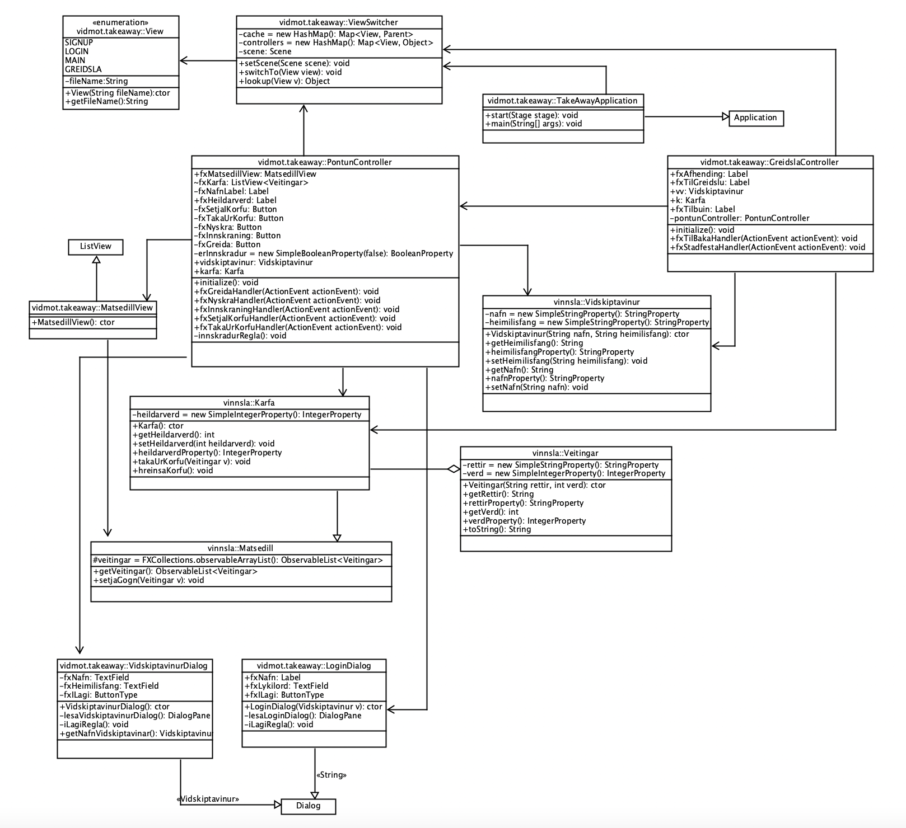

# TakeAway Application

---
### Overview
An application for take away food orders, including features of users creating accounts, logging in, ordering from the menu list etc.  

### Table of Contents
- <u>Installation</u>
- <u>Usage</u>
- <u>UML Class Diagram</u>
- <u>Running JAR</u>
- <u>License</u>

### Installation
- Download or clone the project from GitHub.
- Open the project in your IDE.
- Configure the project settings as needed.
- Build and run the project.

### Usage
To run the project, click the "Run" button in your IDE. Once the project is running, you can interact with it by clicking buttons, entering text in fields, and so on.

### UML Class Diagram
Here below is the UML CLass Diagram for `TakeAway`

An enum class is used in `View`, which defines a set of views in the application, each represented by a constant value. Each constant has a corresponding fileName value that represents the FXML file associated with the view.

### Running JAR
You can either run the Jar file by opening the terminal, navigate to the root directory and running the command java -jar target/TakeAway-1.0-SNAPSHOT.jar or by running the RunJar.cmd file.
The CreateJar.cmd contains the maven command to create the jar file

### License
This project is licensed - see the [LICENSE](LICENSE) file for details.
